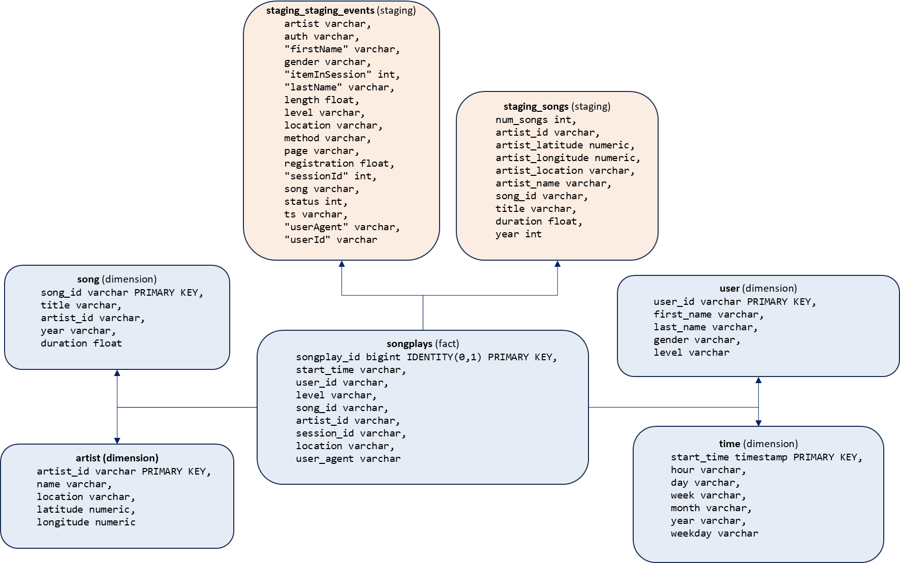
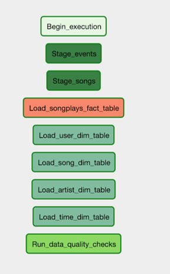
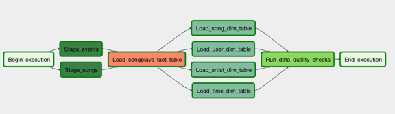
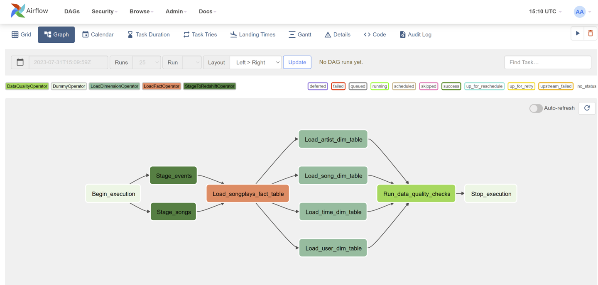
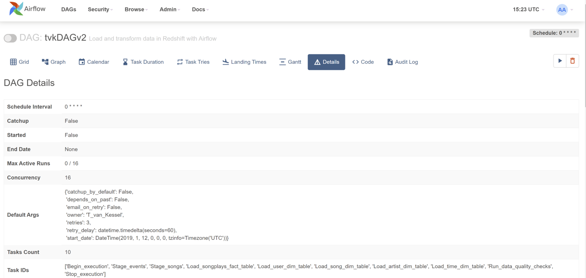

# Udacity-data-pipelines-with-airflow
## 
Automate Data Pipelines Project 4
## Introduction 
(from the project introduction)
A music streaming company, Sparkify, has decided that it is time to introduce more automation and monitoring to their data warehouse ETL pipelines and come to the conclusion that the best tool to achieve this is Apache Airflow.

They have decided to bring you into the project and expect you to create high grade data pipelines that are dynamic and built from reusable tasks, can be monitored, and allow easy backfills. They have also noted that the data quality plays a big part when analyses are executed on top the data warehouse and want to run tests against their datasets after the ETL steps have been executed to catch any discrepancies in the datasets.

The source data resides in S3 and needs to be processed in Sparkify's data warehouse in Amazon Redshift. The source datasets consist of JSON logs that tell about user activity in the application and JSON metadata about the songs the users listen to.
## Code
The following code elements comprise the project:

	* tvkDAGv2.py 			this is the main DAG
	* data_quality_tvk.py		implements the data quality checks
	* load_dimension_tvk.py		loads the data dimension tables
	* load_fact_tvk.py		loads the data fact tables
	* sqlqueries_tvk.py		contains the SqlQueries class and the associated queries to create and load tables
	* stage_redshift_tvk.py		copies the data from Amazon S3 to Redshift
 	* airflow_setup_all.sh		sets up the Redshift connection, S3 path and the Redshift credentials

The **tvkDAGv2.py** is located in the **dags/** directory.
The remaining files are all located for convenience in the **plugins/final_project_operators/** directory

## Datasets

The datasets used for this project are provided by Udacity in their Amazon S3 bucket:

	Log data: s3://udacity-dend/log_data
	Song data: s3://udacity-dend/song_data
 
## Acknowledgments and Sources of Code and Data:

	Udacity project documents 
	README-Template - https://gist.github.com/PurpleBooth/109311bb0361f32d87a2
	ChatGPT
	Udacity GPT
	Google
	Github references: 
 	
 		https://github.com/xingyazhou/udacity-data-pipelines-with-airflow
   		https://github.com/cheuklau/udacity-dataeng-airflow
     		https://github.com/write4alive/Data-Pipelines-with-Apache-Airflow
		https://github.com/tedvankessel/Data-Warehouse-Song-Play-Project
## Scema

The following illustration shows the schema we are trying to acheive with the tvkDAGv2.py program and the data above in Redshift:

## DAG setup
The suggested individual DAG tasks are shown below (from project docs):

The suggested DAG flow configuration is shown below (from project docs:

## Rubric elements

The following sections go through each rubric item and provide evidence of it's
being done.

### Rubric item: Prerequisites
The following prerequisites were satisfied from the earlier lessons and were used
in this project:

	Create an IAM User in AWS.
	Configure Redshift Serverless in AWS.
	Connect Airflow and AWS
	Creat AWS Redshift credentials in Airflow
	Create AWS S3 connection in Airflow
	Connect Airflow to AWS Redshift Serverless
 
I created the auxillary file **airflow_setup_all.sh** to set up the airflow
connections:

	# add AWS Redshift connection
	airflow connections add redshift 
 		note: line truncated to avoid disclosure of redshift credentials
	# add S3 bucket varaible
	airflow variables set s3_bucket tgvkbucket
	# add aws credentials
	airflow connections add aws_credentials 
 		note: line truncated to avoid disclosure of aws credentials
### Rubric item: General

	The dag and plugins do not give an error when imported to Airflow
	All tasks have correct dependencies
 
 This is shown in the following screenshot of the loaded tvkDAGv2.py program
 with the associated dependency graph:
 

### Rubric item: Dag configuration

	* Default_args object is used in the DAG
	* Defaults_args are bind to the DAG
	* The DAG has a correct schedule
 
 The following is the code used to set the defaul_args. Also see tvkDAGv2.py
 
	 default_args = {
	    'owner': 'T_van_Kessel',
	    'start_date': datetime(2019, 1, 12),
	    'depends_on_past': False,
	    'retries': 3,
	    'retry_delay': timedelta(minutes=1),
	    'catchup_by_default': False,
	    'email_on_retry': False
	}
 The details of the default configuration and schedule are shown in the following screenshot:
 

### Rubric item: Staging the data

	* Task to stage JSON data is included in the DAG and uses the RedshiftStage operator
	* Task uses params
	* Logging used
	* The database connection is created by using a hook and a connection

 Two tasks were created for this purpose, **stage_events_to_redshift** and
 **stage_songs_to_redshift**. The full details of the implementation can be found in
 the tvkDAGv2.py, stage_redshift_tvk and the sqlqueries_tvk.py files. These embody all
 aspects of the rubric. The code snippets below show the tasks from the tvkDAGv2.py file. 

	 stage_events_to_redshift = StageToRedshiftOperator(
	    task_id='Stage_events',
	    dag=dag,
	    table = "staging_events",
	    s3_path = "s3://tgvkbucket/log-data",
	    redshift_conn_id="redshift",
	    aws_conn_id="aws_credentials",
	    region="us-east-1",
	    data_format="JSON",
	    sql = "staging_events_table_create"
	)
	stage_songs_to_redshift = StageToRedshiftOperator(
	    task_id='Stage_songs',
	    dag=dag,
	    table = "staging_songs",
	    s3_path = "s3://tgvkbucket/song-data",
	    redshift_conn_id="redshift",
	    aws_conn_id="aws_credentials",
	    region="us-east-1",
	    data_format="JSON",
	    sql = "staging_songs_table_create"
	)
Within the StageToRedshiftOperator (and the other plugins) extensive use of event logging is used. 
This is principally because they are necessary for debugging. 

Finally, in all cases where the tasks communicate with Redshift, the following hooks are used
(taken from the stage_redshift_tvk.py):

 	
	# hook to get redshift credentials
        aws = AwsHook(self.aws_conn_id)
        credentials = aws.get_credentials()

        # hook to get a redshift connection
        self.log.info(f"tvk-temp-debug aws creds {credentials}")
        redshift = PostgresHook(postgres_conn_id=self.redshift_conn_id)

### Rubric Item: Loading dimensions and facts

	* Set of tasks using the dimension load operator is in the DAG 
	* A task using the fact load operator is in the DAG
	* Both operators use params
	* The dimension task contains a param to allow switch between append and insert-delete functionality
 
 The module load_dimension_tvk.py implements the LoadDimensionOperator which is used by the tasks:
 
		load_user_dimension_table
		load_song_dimension_table
		load_artist_dimension_table
		load_time_dimension_table

The module load_fact_tvk.py implements the LoadFactOperator which is used by the task:

		load_songplays_table
  
All of the tasks above and their associated operators use passed parameters that include but are not limited 
to:

        self.redshift_conn_id = redshift_conn_id	# redshift connection
        self.table = table				# table name for create or insert
        self.sql_create = sql_create			# create sql query
        self.sql = sql					# insert sql query
        self.append_only = append_only			# append or delete table

  
The LoadDimensionOperator is passed a parameter **append_only** that determines whether the existing table gets 
it's rows deleted or not.

### Rubric Item: Data Quality Checks

	* A task using the data quality operator is in the DAG and at least one data quality check is done
	* The operator raises an error if the check fails pass
	* The operator is parametrized
 
The data_quality_tvk.py implements a data quality operator to check that each table exists and contains at least 1 row of data.
A list of tables is passed to the DataQualityOperator as a parameter. Each table in the list is checked. If an error is found, 
it is logged and an error is raised. Execution continues untill the list is finished.

The following is the output log from the quality check showing that all tables are present and contain data:

	AIRFLOW_CTX_DAG_OWNER=T_van_Kessel
	AIRFLOW_CTX_DAG_ID=tvkDAGv2
	AIRFLOW_CTX_TASK_ID=Run_data_quality_checks
	AIRFLOW_CTX_EXECUTION_DATE=2023-08-03T19:19:39.442626+00:00
	AIRFLOW_CTX_TRY_NUMBER=1
	AIRFLOW_CTX_DAG_RUN_ID=manual__2023-08-03T19:19:39.442626+00:00
	[2023-08-03, 19:31:31 UTC] {base.py:68} INFO - Using connection ID 'redshift' for task execution.
	[2023-08-03, 19:31:31 UTC] {sql.py:375} INFO - Running statement: SELECT COUNT(*) FROM songplay, parameters: None
	[2023-08-03, 19:31:31 UTC] {sql.py:384} INFO - Rows affected: 1
	[2023-08-03, 19:31:32 UTC] {data_quality_tvk.py:48} INFO - Data quality on table songplay check passed with 2476 records
	[2023-08-03, 19:31:32 UTC] {base.py:68} INFO - Using connection ID 'redshift' for task execution.
	[2023-08-03, 19:31:32 UTC] {sql.py:375} INFO - Running statement: SELECT COUNT(*) FROM users, parameters: None
	[2023-08-03, 19:31:32 UTC] {sql.py:384} INFO - Rows affected: 1
	[2023-08-03, 19:31:32 UTC] {data_quality_tvk.py:48} INFO - Data quality on table users check passed with 107 records
	[2023-08-03, 19:31:32 UTC] {base.py:68} INFO - Using connection ID 'redshift' for task execution.
	[2023-08-03, 19:31:32 UTC] {sql.py:375} INFO - Running statement: SELECT COUNT(*) FROM song, parameters: None
	[2023-08-03, 19:31:32 UTC] {sql.py:384} INFO - Rows affected: 1
	[2023-08-03, 19:31:32 UTC] {data_quality_tvk.py:48} INFO - Data quality on table song check passed with 62385 records
	[2023-08-03, 19:31:32 UTC] {base.py:68} INFO - Using connection ID 'redshift' for task execution.
	[2023-08-03, 19:31:33 UTC] {sql.py:375} INFO - Running statement: SELECT COUNT(*) FROM artist, parameters: None
	[2023-08-03, 19:31:33 UTC] {sql.py:384} INFO - Rows affected: 1
	[2023-08-03, 19:31:33 UTC] {data_quality_tvk.py:48} INFO - Data quality on table artist check passed with 21750 records
	[2023-08-03, 19:31:33 UTC] {base.py:68} INFO - Using connection ID 'redshift' for task execution.
	[2023-08-03, 19:31:33 UTC] {sql.py:375} INFO - Running statement: SELECT COUNT(*) FROM time, parameters: None
	[2023-08-03, 19:31:33 UTC] {sql.py:384} INFO - Rows affected: 1
	[2023-08-03, 19:31:33 UTC] {data_quality_tvk.py:48} INFO - Data quality on table time check passed with 8023 records
	[2023-08-03, 19:31:33 UTC] {taskinstance.py:1400} INFO - Marking task as SUCCESS. dag_id=tvkDAGv2, task_id=Run_data_quality_checks, execution_date=20230803T191939, start_date=20230803T193130, end_date=20230803T193133
	[2023-08-03, 19:31:33 UTC] {local_task_job.py:156} INFO - Task exited with return code 0

### Installing
## References
## License
This project is licensed under the Apache 2.0  License - see the LICENSE.md file for details
## Built With
Starter code was provided by Udacity as follows:

	/home/workspace/airflow/plugins/final_project_operators/data_quality.py
	/home/workspace/airflow/plugins/final_project_operators/load_fact.py
	/home/workspace/airflow/plugins/custom_operators/load_dimensions.py
	/home/workspace/airflow/plugins/final_project_operators/stage_redshift.py
	/home/workspace/airflow/dags/udacity/common/final_project_sql_statements.py
	/home/workspace/airflow/dags/cd0031-automate-data-pipelines/project/starter/final_project.py
## Author
**Theodore van Kessel** 
 

